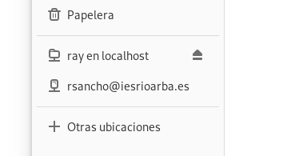

### proftpd en debian 

see [https://www.ionos.es/digitalguide/servidores/configuracion/servidor-ftp-en-debian/](https://www.ionos.es/digitalguide/servidores/configuracion/servidor-ftp-en-debian/)

### vsftpd en debian 

Very Secure FTP Daemon is a popular and secure FTP server used in Linux and Unix systems, including Debian. To install on Debian:

```bash
sudo apt update && sudo apt upgrade
sudo apt install vsftpd
# start vsftpd service
sudo systemctl start vsftpd
# To ensure autostart at boot time:
sudo systemctl enable vsftpd
```

Configure: `/etc/vsftpd.conf` file. Some key confs:

- enabling local users
- disabling anonymous users
- enabling write permissions:

```plaintext:q
anonymous_enable=NO
local_enable=YES
write_enable=YES
```

++seq : enable SSL/TLS encryption for FTP connections.
This involves creating SSL certificates and configuring vsftpd to use them.
Detailed steps: refer to specific guides

To allow FTP traffic through the firewall must open ports:

```bash
sudo apt install ufw -y
sudo apt install firewalld rsyslog -y

sudo ufw enable  # test
sudo ufw disable # test

sudo ufw allow 21/tcp   # en srv: ctl (cmd's)
sudo ufw allow 20/tcp   # en srv: data
# en cli son: ctl: aleatorio N (>1023), y 
#             data: N+1.

sudo ufw allow 990/tcp  #?
sudo ufw allow 40000:50000/tcp  #?
```

These commands will open ports 20, 21, 990, and a range 40000..50000 for FTP traffic

For further configuration and security settings, you can refer to detailed guides on configuring vsftpd for Debian

## otros servidores

https://www.sysprovider.es/blog/mejores-servidores-ftp-gratis/


# objetivos

## FTP: operacion y modos de funcionamiento?

- es orientado a conexion; la inicia cualquier lado (cli o srv)
  - modo activo: cli activa ("ataca")
  - modo pasivo: cli indica "disposición"

## administrar: usuarios, grupos y cuotas

- la notacion POSIX `rwxrwxrwx`
- [ ] ejercicio: de todas las numeraciones en el rango 777 a 000 ¿cuales tienen poco-nulo sentido?
- Usuario anonymous (nameless) Convenio: pass: email
- Cuotas... servidor con FS que de soporte a cuotas
  - @linux: `quota` y montar el FS activando el tema.

    `tune2fs` # adjust tunable file system parameters on ext2/ext3/ext4 file systems


- comandos esenciales?
- instalar/configurar un servidor (en Windows y en Linux)

- Compartir carpetas con NFS en Linux y habilitar el acceso a ellas en Windows con SFU
- Aprender a compartir carpetas por CIFS en Windows
- Saber instalar un servidor SAMBA en Linux e integrarlo en una red Windows
- Aprender a desplegar un servidor dedicado con S.O. específico para servir archivos

# etc

## pptx-to-beamer -dockerized-

see [https://github.com/tomaz-suller/pptx-to-beamer](https://github.com/tomaz-suller/pptx-to-beamer) 


- [x] enabling anonymous access, 
- [x] setting the FTP root directory, 
- [ ] configuring user permissions, 
- [ ] enabling SSL/TLS encryption.

```bash:
$ lftp
lftp :~> help
    !<orden-de-shell>                    (órdenes)
    alias [<nombre> [<valor>]]           attach [PID]
    bookmark [SUBORDEN]                  cache [SUBORDEN]
    cat [-b] <archivos>                  cd <dir_remoto>
    chmod [OPTS] modo archivo...         close [-a]
    [re]cls [opts] [path/][pattern]      debug [OPTS] [<level>|off]
    du [options] <dirs>                  edit [OPTS] <file>
    exit [<código>|bg]                   get [OPCS] <arch_r> [-o <arch_l>]
    glob [OPTS] <cmd> <args>             help [<ord>]
    history -w file|-r file|-c|-l [cnt]  jobs [-v] [<job_no...>]
    kill all|<númtarea>                  lcd <dirlocal>
    lftp [OPCS] <servidor>               ln [-s] <file1> <file2>              
    ls [<args>]
    mget [OPCS] <archivos>               mirror [OPCS] [remoto [local]]
    mkdir [OPTS] <dirs>                  module nombre [args]
    more <archivos>                      mput [OPCS] <archivos>
    mrm <archivos>                       mv <archivo1> <archivo2>
    mmv [OPTS] <files> <target-dir>      [re]nlist [<args>]
    open [OPCS] <servidor>               pget [OPCS] <arch_r> [-o <arch_l>]
    put [OPCS] <arch_l> [-o <arch_r>]    pwd [-p]
    queue [OPTS] [<cmd>]                 quote <orden>
    repeat [OPTS] [delay] [command]      rm [-r] [-f] <archivos>
    rmdir [-f] <dirs>                    scache [<núm_sesión>]
    set [OPT] [<var> [<val>]]            site <site-cmd>
    source <archivo>                     torrent [OPTS] <file|URL>...
    user <usuario|URL> [<clave>]         wait [<númtarea>]
    zcat <archivos>                      zmore <archivos>
```

```bash:
lftp localhost 
>> ls 
vsftpd 500 OOPS Error
```bash:

The error "500 OOPS: vsftpd: refusing to run with writable root inside chroot()" occurs when the root directory for a chrooted user is writable, which is against vsftpd's security policy. To resolve this, you can either make the root directory non-writable or add the `allow_writeable_chroot=YES` directive to the `/etc/vsftpd.conf` file, then restart vsftpd

Alternatively, if you need to enable uploads, you can create a writable subdirectory within the root directory. For example, you can create a directory `/srv/ftp/upload` and set it as writable

Another solution involves setting the `chroot_local_user` parameter to "NO" in the vsftpd configuration file, which disables chroot for local users

If you are using a system like PowerScale OneFS, you may need to ensure that the chroot directory is not writable and that the `allow_writeable_chroot` setting is appropriately configured


solutions tried
- [x] :/ added `allow_writeable_chroot=YES` to `/etc/vsftpd.conf`;  restart vsftpd
- [x] :/ make unwirtable: ""#"" write_enable=YES
- [x] :/ set chroot_local_user parameter to "NO" in vsftpd -disables chroot 4 local users-.

anotamos el vsftpd.conf falido

```sh
anon_root=/rootftpfolder
anon_upload_enable=YES
anonymous_enable=YES
chroot_local_user=NO
connect_from_port_20=YES
dirmessage_enable=YES
listen_ipv6=YES
listen=NO
local_enable=YES
local_root=/rootftpfolder
ls_recurse_enable=YES
no_anon_password=YES
pam_service_name=vsftpd
rsa_cert_file=/etc/ssl/certs/ssl-cert-snakeoil.pem
rsa_private_key_file=/etc/ssl/private/ssl-cert-snakeoil.key
secure_chroot_dir=/var/run/vsftpd/empty
ssl_enable=NO
use_localtime=YES
utf8_filesystem=YES
xferlog_enable=YES
```

- [ ] estado zeroconf

Reconfiguramos con el vsftpd.conf reseteado y utilizamos los valores defectivos para todo...

```bash:
sudo apt-get remove vsftpd 
sudo apt-get purge vsftpd
find /etc | grep vsftp ...
sudo find /etc | grep vsftp | xargs sudo rm

Reinstalamos y ahora si:

```bash:
$ lftp ftp://ray@localhost
Clave: 
lftp ray@localhost:~>                                      
lftp ray@localhost:~> 
lftp ray@localhost:~> ls /y sale mi home

drwxr-xr-x    9 1000     1001         4096 Feb 27 09:48 Descargas
drwxr-xr-x    3 1000     1001         4096 Jan 29 13:24 Documentos
drwxr-xr-x    2 1000     1001         4096 Jan 12 20:33 Escritorio
drwxr-xr-x    3 1000     1001         4096 Feb 26 13:26 Imágenes
drwxr-xr-x    2 1000     1001         4096 Jan 12 12:30 Música
drwxr-xr-x    2 1000     1001         4096 Jan 12 12:30 Plantillas
drwxr-xr-x    2 1000     1001         4096 Jan 12 12:30 Público
...
```

Tambien se ve todo en nautilus. 

No se puede mover ni eliminar ficheros

- [x] abrimos anon:
  - [x] anonymous_enable=NO 
  - [x] anon_root : default **/srv/ftp**. Si.
    - [x ] sudo touch /srv/ftp/algo.vacio.txt .. visible to anon user:

```bash:
lftp localhost:/> ls
-rw-r--r--    1 0        0               0 Feb 27 18:37 algo.vacio.txt
```

- [x] ¿puede subir algo el usuario normal? NO 
  - [x] `write_enable=YES`
- [x] puede

